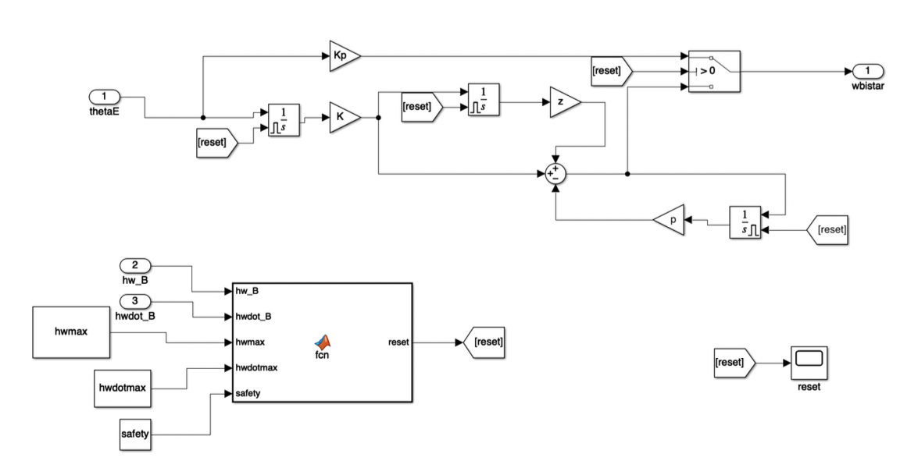
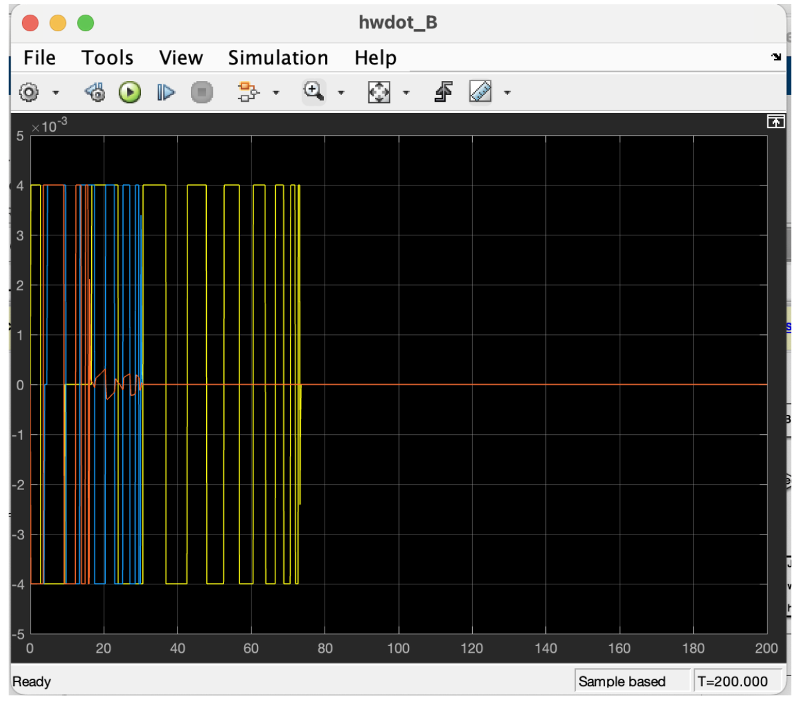
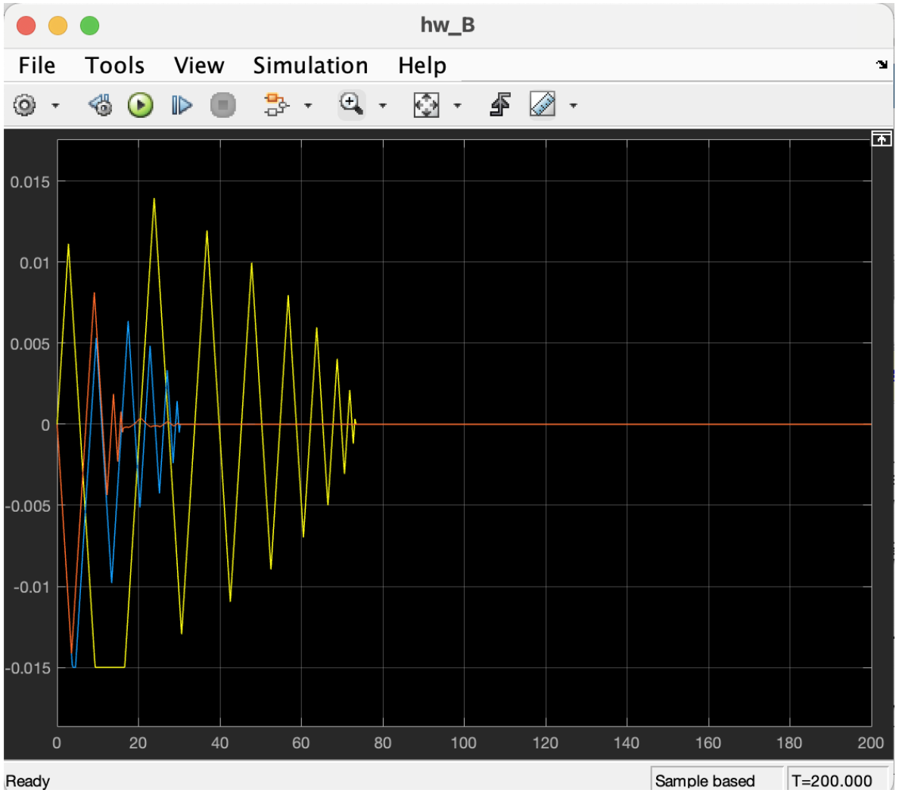

# Reaction Wheel Controller Design (Simulink)
Spacecraft Attitude Control with Actuator Saturation + Time Delay

Redesigned a spacecraft reaction wheel attitude controller in Simulink to account for actuator saturation while meeting stability requirements of **≥6 dB gain margin** and **≥60° phase margin**, including a **0.01 s time delay** and **second-order wheel dynamics**.

## Key Features
- Actuator saturation handling (torque and momentum limits)
- Anti-windup strategy with proportional fallback
- Trapezoidal attitude command trajectories
- Optional command feedforward
- Comparative evaluation across four control scenarios

## Model & Results

### Simulink Model Overview

### Tracking Performance

### Actuator Saturation Behavior

### Scenario Comparison

## Reaction Wheel Constraints (RWP015)
- Max torque: **4 mNm**
- Max momentum: **15 mNms**
(Based on the Blue Canyon Technologies RWP015 datasheet)

## Test Scenarios
1. Standard step input
2. Anti-windup + proportional fallback
3. Trapezoidal trajectory tracking
4. Trapezoidal trajectory + command feedforward

## Evaluation Metrics
- Slew time
- Attitude tracking error
- Commanded torque vs saturation
- Reaction wheel momentum buildup

## Repo Structure
- `model/` – Simulink model files (.slx)
- `scripts/` – MATLAB scripts for running simulations and generating plots
- `results/` – exported plots/tables
- `docs/` – technical report and derivations
- `media/` – images used in this README

## Course Context
Developed as part of spacecraft attitude dynamics & control coursework at Utah State University (Mar–Apr 2025).
